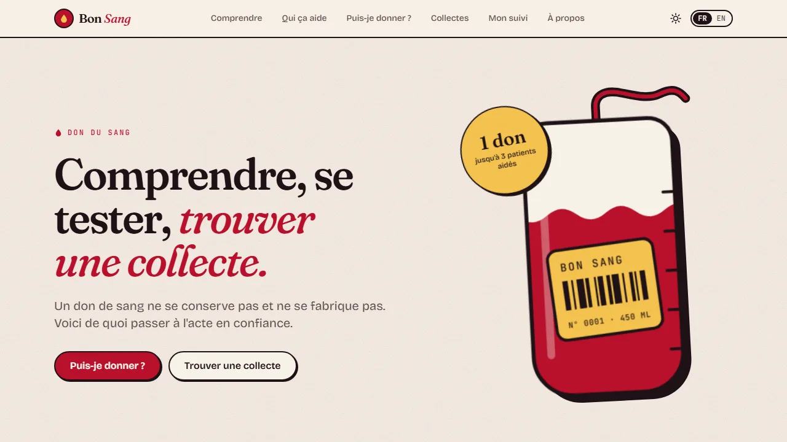
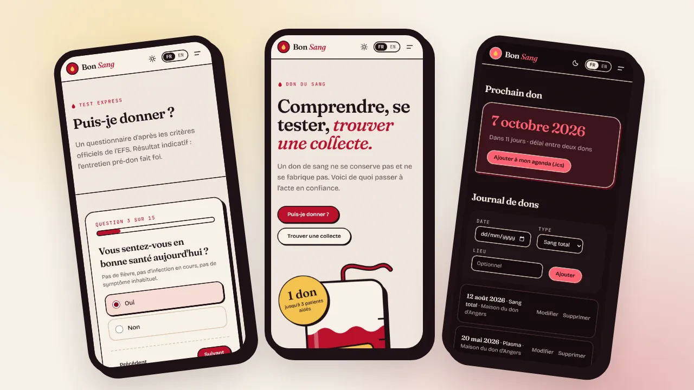

# Bon Sang

**Bon Sang** est un site d'information et d'incitation au don du sang : comprendre à quoi sert
un don et qui il aide, tester son éligibilité, trouver une collecte près de chez soi et être
rappelé dès qu'on peut redonner.

**Statut : terminé** — v1.0.0 (septembre 2026). En ligne sur
[bon-sang.vercel.app](https://bon-sang.vercel.app/). Projet de portfolio ; historique dans
[`CHANGELOG.md`](./CHANGELOG.md), plan de développement dans [`ROADMAP.md`](./ROADMAP.md).



## Fonctionnalités

- **Comprendre** — à quoi sert un don, le parcours d'une poche, chiffres clés sourcés (EFS).
- **Qui ça aide** — fiches drépanocytose / mucoviscidose / maladie de Steinert, témoignages
  (personas illustratifs) et associations de patients.
- **Puis-je donner ?** — quiz d'éligibilité multi-étapes d'après les critères EFS (version des
  critères datée), réponses conservées, verdict : éligible / à patienter (+ date calculée) /
  à vérifier avec le médecin / contre-indication.
- **Collectes** — recherche par ville, carte MapLibre clusterisée + liste synchronisées, filtres
  par type de don et par période, « autour de moi » (rayon, tri par distance), lien de partage
  d'une collecte. Source : API Carto de l'EFS.
- **Mon suivi** — journal de dons (ajout, édition), prochaine date d'éligibilité (plafonds
  annuels H/F), statistiques, badges, export `.ics` (avec rappel la veille) et JSON,
  **100 % local** (aucun serveur, aucun compte).
- Bilingue **FR / EN**, thème clair / sombre (système ou choix manuel), utilisable hors ligne
  pour le quiz et le suivi (service worker), accessible au clavier et aux lecteurs d'écran
  (WCAG A/AA vérifiées par axe en CI).

## Design — thème « Plasma & Globule »

Identité graphique propre, inspirée des composants du sang et de l'univers des poches de don :

- **Palette** : papier crème et encre bordeaux, rouge « globule », jaune « plasma » (la vraie
  couleur d'une poche de plasma), bleu « veine » ; thème sombre « Nuit » bordeaux-noir.
  Contrastes WCAG AA vérifiés.
- **Typographie** : Fraunces (titres), Bricolage Grotesque (texte), JetBrains Mono (étiquettes).
- **Motifs** : cartes « sticker » (trait encre, ombre décalée, coin « étiquette »), grain
  papier, gouttes, bords ondulés, tubulure reliant les étapes, poche de sang illustrée.
- Tokens dans `src/app/globals.css` (Tailwind v4 `@theme`), primitives dans
  `src/components/ui/` (`buttonClasses`, `cardClasses`, `inputClasses`, `chipClasses`…).



## Stack

- **Next.js 16** (App Router, RSC, Turbopack) + **React 19** + **TypeScript 6** strict
- **Tailwind CSS v4**, polices via `next/font`
- **next-intl** v4 — FR par défaut sans préfixe, EN sous `/en`
- **MapLibre GL** 5 + fonds **CARTO** (`voyager` / `dark-matter`, sans clé)
- **Vitest** + Testing Library (logique pure et composants) · **Playwright** + **axe**
  (parcours E2E et accessibilité) · Lighthouse CI
- ESLint (`@forthtilliath/eslint-config`), Prettier, lefthook
- Vercel (hébergement, Analytics sans cookie)

## Démarrage

```bash
npm install
npm run dev
```

Le site tourne sur [http://localhost:3000](http://localhost:3000). En développement, aucune
variable d'environnement n'est requise ; `.env.example` liste les surcharges facultatives.

## Scripts

| Script                  | Rôle                                       |
| ----------------------- | ------------------------------------------ |
| `npm run dev`           | Serveur de développement (Turbopack)       |
| `npm run build`         | Build de production                        |
| `npm run start`         | Sert le build de production                |
| `npm run lint`          | ESLint                                     |
| `npm run typecheck`     | Types des routes + vérification TypeScript |
| `npm test`              | Tests unitaires et de composants (Vitest)  |
| `npm run test:coverage` | Idem avec couverture et seuils             |
| `npm run e2e`           | Tests de bout en bout + accessibilité      |
| `npm run format`        | Formate le code avec Prettier              |

## Tests

- **Unitaires et composants** (`npm test`, 149 tests) — moteur d'éligibilité, prochaine date,
  badges, `.ics`, validation d'import, normalisation et filtres des collectes, parité des
  traductions FR/EN, composants du quiz, du suivi et de l'explorateur de collectes.
- **E2E** (`npm run e2e`, 18 tests) — accueil, navigation et langue, parcours du quiz, journal
  de dons, recherche de collectes avec carte et bulle d'info, et scan **axe** WCAG A/AA sur les
  6 pages principales. Playwright lance un build de production ;
  `npx playwright install chromium` au premier usage.

La CI (GitHub Actions) exécute format, lint, typecheck, tests avec couverture et build, puis
les tests E2E et un budget Lighthouse. `main` exige une CI verte et une branche à jour.

## Dépendances

Dependabot propose chaque semaine au plus trois PR groupées (prod, dev, GitHub Actions).
Certaines montées majeures, testées et incompatibles, sont ignorées (`.github/dependabot.yml`) :
`maplibre-gl` 6 (les tuiles CARTO ne se chargent plus), `eslint` 10 (plugins pas encore
compatibles), `typescript` ≥ 6.1 (hors plage de `typescript-eslint`) et `@types/node` majeure
(alignée sur Node 24, cf. `.nvmrc`).

## Déploiement (Vercel)

1. Importer le dépôt sur [Vercel](https://vercel.com/new) — Next.js est détecté automatiquement.
2. Définir `NEXT_PUBLIC_SITE_URL` avec l'URL de production (métadonnées, sitemap, OpenGraph) :
   le build de production échoue si elle est absente.
3. Chaque push sur `main` déclenche un déploiement ; chaque PR obtient un aperçu.

## Données & mentions

Les collectes proviennent de l'**API Carto de l'EFS** (Établissement français du sang). Les
critères d'éligibilité sont repris de la documentation grand public de l'EFS. Ce site n'est
**pas affilié** à l'EFS — voir la page « À propos ».

Aucune donnée personnelle n'est envoyée à un serveur : le journal de dons, le rappel
d'éligibilité et les réponses du quiz restent dans le navigateur (`localStorage`).
